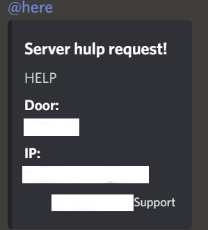

# Support Plugin
Commands:
- /support <message\>  -> Sends the message along with minecraft username and serverip to the webhook

  
Everything is customizable, and it works only on the ip's you want it to work
Look at [config.java](src/main/java/nl/lokerhp/utility/util/Config.java) for the settings

Special Thanks to [k3kdude](https://gist.github.com/k3kdude) for the discord webhook code!
